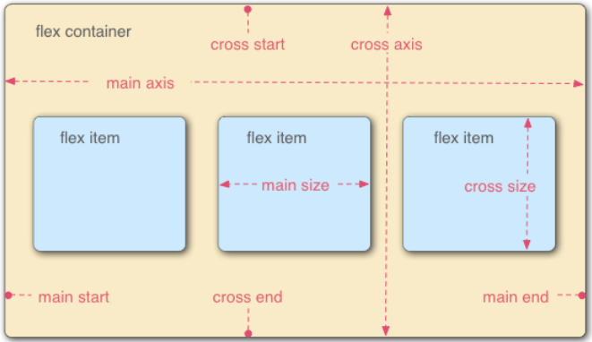

# flex布局
## 1. flex布局定义
Flex是Flexible Box的缩写，意为"弹性布局"，用来为盒状模型提供最大的灵活性。
任何一个容器都可以指定为Flex布局。例如：
``` css
.box{
    display: flex;
}
// 行内元素也可以使用flex布局
.box{
    display: inline-flex;
}
// Webkit 内核的浏览器，必须加上-webkit前缀
.box{
    display: -webkit-flex; /* Safari */
    display: flex;
}
```
注：设为Flex布局以后，子元素的float、clear和vertical-align属性将失效。

## 2. 基本概念
采用 Flex 布局的元素，称为 Flex 容器（flex container），简称"容器"。它的所有子元素自动成为容器成员，称为 Flex 项目（flex item），简称"项目"。



容器默认存在两根轴：水平的主轴（main axis）和垂直的交叉轴（cross axis）。主轴的开始位置（与边框的交叉点）叫做main start，结束位置叫做main end；交叉轴的开始位置叫做cross start，结束位置叫做cross end。

项目默认沿主轴排列。单个项目占据的主轴空间叫做main size，占据的交叉轴空间叫做cross size。