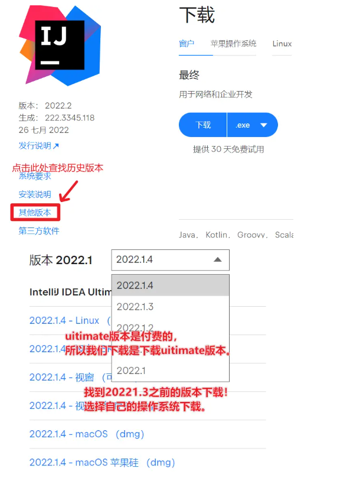

# IDEA-2022.1.2简单快速激活到2099年

___注意：本脚本做了向下兼容到2020.1，向上兼容2022.1.2。如果您不想升级，直接执行脚本后重启软件就可以完成激活。 作者：凛晨一点 https://www.bilibili.com/read/cv17855841___

- **第一步：下载软件**
官方地址：<https://www.jetbrains.com/idea/download/#section=windows>

- **第二步：下载破解包**  
百度网盘：<https://pan.baidu.com/s/1zkuuZAahSsW-6hYHy1mHgQ?>  
验证码：6666

- **第三步：破解过程**  
(1) 软件安装，下载好对应版本后一直点击下一步(NEXT)就行。安装完成后到注册页面后退出（EXIT）  
(2) 确保IDEA处于关闭状态，打开我提供的破解包，双击ideaActive.vbs.会弹出一个窗口，点击确认就行  
(3) 启动IDEA找到刚才的登录界面，点击Activation code将我提供的激活码.txt粘贴到此处，随后点击Activate这样我们的激活步骤就完成了。