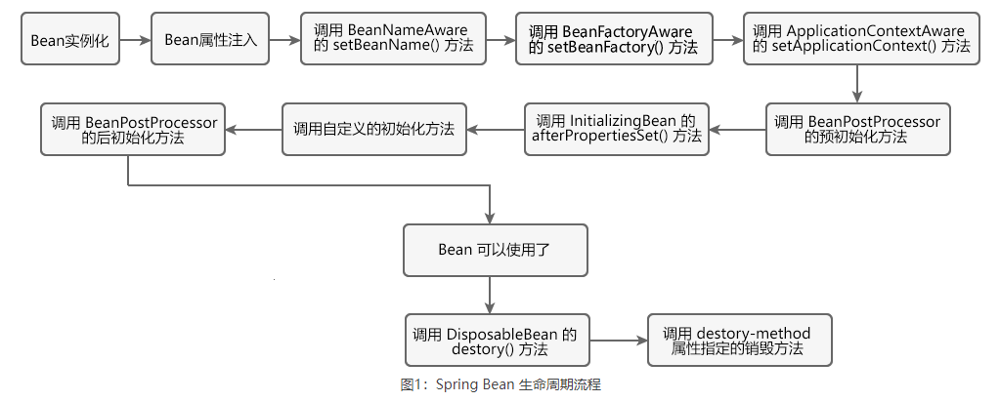

# IoC learn
## 1. IoC工作原理
IoC底层通过工厂模式、Java的反射机制、XML解析等技术，将代码的耦合度降低到最低限度，其主要步骤如下：
+ 在配置文件中，对各个对象及他们之间的依赖关系进行配置；
+ 可以把IoC容器当作一个工厂，这个工厂的产品就是Spring Bean；
+ 容器启动时会加载并解析这些配置文件，得到对象的基本信息以及他们之间的依赖关系；
+ IoC利用Java的反射机制，根据类名生成相应的对象，并根据依赖关系将这个对象注入到依赖他的对象中。 

由于对象的基本信息、对象之间的依赖关系都是配置文件中定义的，并没有代码的紧密耦合，因此即使对象发生改变，也只需要在配置文件中进行修改即可，而无须对Java代码进行修改，这就是IoC实现解耦的原理。  

## 2. 容器的两种实现
IoC思想基于IoC容器实现的，IoC容器底层其实就是一个Bean工厂，有两种不同的IoC容器，分贝是BeanFactory和ApplicationContext。  
+ **BeanFactory**  
BeanFactory 是 IoC 容器的基本实现，也是 Spring 提供的最简单的 IoC 容器，它提供了 IoC 容器最基本的功能，由 org.springframework.beans.factory.BeanFactory 接口定义。
BeanFactory 采用懒加载（lazy-load）机制，容器在加载配置文件时并不会立刻创建 Java 对象，只有程序中获取（使用）这个对对象时才会创建。  
**注意**：BeanFactory 是 Spring 内部使用接口，通常情况下不提供给开发人员使用。 

+ **ApplicationContext**  
ApplicationContext 是 BeanFactory 接口的子接口，是对 BeanFactory 的扩展。ApplicationContext 在 BeanFactory 的基础上增加了许多企业级的功能，例如 AOP（面向切面编程）、国际化、事务支持等。  

ApplicationContext 接口有两个常用的实现类，具体如下表。  
| 实现类 | 描述 | 示例代码 |
| :----:  | :---- | :---- |
| ClassPathXmlApplicationContext | 加载类路径 ClassPath 下指定的 XML 配置文件，并完成 ApplicationContext 的实例化工作 | ApplicationContext applicationContext = new ClassPathXmlApplicationContext(String configLocation); |
| FileSystemXmlApplicationContext | 加载指定的文件系统路径中指定的 XML 配置文件，并完成 ApplicationContext 的实例化工作	 | ApplicationContext applicationContext = new FileSystemXmlApplicationContext(String configLocation); |  

## 3. Bean定义
由 Spring IoC 容器管理的对象称为 Bean，Bean 根据 Spring 配置文件中的信息创建。可以把 Spring IoC 容器看作是一个大工厂，Bean 相当于工厂的产品。如果希望这个大工厂生产和管理 Bean，就需要告诉容器需要哪些 Bean，以哪种方式装配。通常情况下，Spring 的配置文件都是使用 XML 格式的。XML 配置文件的根元素是 <beans>，该元素包含了多个子元素 <bean>。每一个 <bean> 元素都定义了一个 Bean，并描述了该 Bean 是如何被装配到 Spring 容器中的。  
在 XML 配置的<beans> 元素中可以包含多个属性或子元素，常用的属性或子元素如下表所示。  
| 属性名称 | 描述 |
| :---- | :---- |
| id | Bean 的唯一标识符，Spring IoC 容器对 Bean 的配置和管理都通过该属性完成。id 的值必须以字母开始，可以使用字母、数字、下划线等符号。 |
| name | 该属性表示 Bean 的名称，我们可以通过 name 属性为同一个 Bean 同时指定多个名称，每个名称之间用逗号或分号隔开。Spring 容器可以通过 name 属性配置和管理容器中的 Bean。 |
| class | 该属性指定了 Bean 的具体实现类，它必须是一个完整的类名，即类的全限定名。 |
| scope | 表示 Bean 的作用域，属性值可以为 singleton（单例）、prototype（原型）、request、session 和 global Session。默认值是 singleton。 |
| constructor-arg | <bean> 元素的子元素，我们可以通过该元素，将构造参数传入，以实现 Bean 的实例化。该元素的 index 属性指定构造参数的序号（从 0 开始），type 属性指定构造参数的类型。 |
| property | <bean>元素的子元素，用于调用 Bean 实例中的 setter 方法对属性进行赋值，从而完成属性的注入。该元素的 name 属性用于指定 Bean 实例中相应的属性名。 |
| ref | <property> 和 <constructor-arg> 等元素的子元索，用于指定对某个 Bean 实例的引用，即 <bean> 元素中的 id 或 name 属性。 |
| value | <property> 和 <constractor-arg> 等元素的子元素，用于直接指定一个常量值。 |
| list | 用于封装 List 或数组类型的属性注入。 |
| set | 用于封装 Set 类型的属性注入。 |
| map | 用于封装 Map 类型的属性注入。 |
| entry | <map> 元素的子元素，用于设置一个键值对。其 key 属性指定字符串类型的键值，ref 或 value 子元素指定其值。 |
| init-method | 容器加载 Bean 时调用该方法，类似于 Servlet 中的 init() 方法 |
| destroy-method | 容器删除 Bean 时调用该方法，类似于 Servlet 中的 destroy() 方法。该方法只在 scope=singleton 时有效 |
| lazy-init | 懒加载，值为 true，容器在首次请求时才会创建 Bean 实例；值为 false，容器在启动时创建 Bean 实例。该方法只在 scope=singleton 时有效 |  

## 4. Bean属性注入方法
- **构造函数注入**  
使用构造函数实现属性注入大致步骤如下：  
（1）在Bean中添加一个有参构造函数，构造函数内的每一个参数代表一个需要注入的属性；  
（2）在Spring的XML配置文件中，通过<beans>及其子元素<bean>对Bean进行定义；  
（3）在<bean>元素内使用<constructor-arg>元素，对构造函数内的属性进行赋值，Bean的构造函数内有多少参数，就需要使用多少个 <constructor-arg> 元素。  
**简易方法：c命名空间注入**  
步骤：  
（1）在配置文件的 <beans> 元素中导入以下 XML 约束。  
xmlns:c="http://www.springframework.org/schema/c"  
（2）在导入XML约束后，我们就能通过以下形式实现属性注入。  
<bean id="Bean 唯一标志符" class="包名+类名" c:普通属性="普通属性值" c:对象属性-ref="对象的引用">
使用c命名空间注入依赖时，必须注意以下2点：  
a. Java 类中必须包含对应的带参构造器；  
b.在使用c命名空间实现属性注入前，XML配置的<beans>元素内必须先导入c命名空间的XML约束。  
- **setter注入**  
使用setter注入的方式进行属性注入，大致步骤如下：  
（1）在Bean中提供一个默认的无参构造函数（在没有其他带参构造函数的情况下，可省略），并为所有需要注入的属性提供一个setXxx()方法；  
（2）在Spring的 XML 配置文件中，使用<beans>及其子元素<bean>对Bean进行定义；  
（3）在<bean>元素内使用<property>元素对各个属性进行赋值。  
**简易方法：p命名空间注入**  
步骤：  
（1）需要在配置文件的 <beans> 元素中导入以下 XML 约束。  
xmlns:p="http://www.springframework.org/schema/p"  
（2）在导入 XML 约束后，我们就能通过以下形式实现属性注入。  
<bean id="Bean 唯一标志符" class="包名+类名" p:普通属性="普通属性值" p:对象属性-ref="对象的引用">  

## 5. Spring注入内部Bean
定义在 <bean> 元素的 <property> 或 <constructor-arg> 元素内部的 Bean，称为“内部 Bean”。  
**注意**：内部 Bean 都是匿名的，不需要指定 id 和 name 的。即使制定了，IoC 容器也不会将它作为区分 Bean 的标识符，反而会无视 Bean 的 Scope 标签。因此内部 Bean 几乎总是匿名的，且总会随着外部的 Bean 创建。内部 Bean 是无法被注入到它所在的 Bean 以外的任何其他 Bean 的。
- setter 方式注入内部Bean
```java
<?xml version="1.0" encoding="UTF-8"?>
<beans xmlns="http://www.springframework.org/schema/beans"
       xmlns:xsi="http://www.w3.org/2001/XMLSchema-instance"
       xsi:schemaLocation="http://www.springframework.org/schema/beans
   http://www.springframework.org/schema/beans/spring-beans-3.0.xsd">
    <bean id="outerBean" class="……">
        <property name="……" >
            <!-- 定义内部 Bean -->
            <bean class="……">
                <property name="……" value="……" ></property>
                ……
            </bean>
        </property>
    </bean>
</beans>
```
- 构造函数方式注入内部Bean
```java
<beans xmlns="http://www.springframework.org/schema/beans"
       xmlns:xsi="http://www.w3.org/2001/XMLSchema-instance"
       xsi:schemaLocation="http://www.springframework.org/schema/beans
   http://www.springframework.org/schema/beans/spring-beans-3.0.xsd">
    <bean id="……" class="……">
        <constructor-arg name="……">
            <!--内部 Bean-->
            <bean class="……">
                <constructor-arg name="……" value="……"></constructor-arg>
                ……
            </bean>
        </constructor-arg>
    </bean>
</beans>
```

## 6. Spring注入集合
在 Bean 标签下的 <property> 元素中，使用以下元素配置 Java 集合类型的属性和参数，例如 List、Set、Map 以及 Properties 等。
| 标签 | 说明 |
| :--- | :--- |
| \<list\> | 用于注入 list 类型的值，允许重复 |
| \<set\> | 用于注入 set 类型的值，不允许重复 |
| \<map\> | 用于注入 key-value 的集合，其中 key 和 value 都可以是任意类型 |
| \<props\> | 用于注入 key-value 的集合，其中 key  和 value 都是字符串类型 |
- 在集合中设置普通类型的值: [例如](http://c.biancheng.net/spring/collection-injection.html)
- 在集合中设置对象类型的值: [例如](http://c.biancheng.net/spring/collection-injection.html)
- Spring注入其他类型的属性：[例如](http://c.biancheng.net/spring/other-injection.html)

## 7. Spring Bean作用域
默认情况下，所有的 Spring Bean 都是单例的，也就是说在整个 Spring 应用中， Bean 的实例只有一个。可以在 <bean> 元素中添加 scope 属性来配置 Spring Bean 的作用范围。  
Spring 5 共提供了 6 种 scope 作用域，如下表。  
| 作用范围 | 描述 |
| :--- | :--- |
| singleton | 默认值，单例模式，表示在 Spring 容器中只有一个 Bean 实例 |
| prototype | 原型模式，表示每次通过 Spring 容器获取 Bean 时，容器都会创建一个新的 Bean 实例。 |
| request | 每次 HTTP 请求，容器都会创建一个 Bean 实例。该作用域只在当前 HTTP Request 内有效。 |
| session | 同一个 HTTP Session 共享一个 Bean 实例，不同的 Session 使用不同的 Bean 实例。该作用域仅在当前 HTTP Session 内有效。 |
| application | 同一个 Web 应用共享一个 Bean 实例，该作用域在当前 ServletContext 内有效。与singleton类似，但 singleton 表示每个 IoC 容器中仅有一个 Bean 实例，而一个 Web 应用中可能会存在多个 IoC 容器，但一个 Web 应用只会有一个 ServletContext，也可以说 application 才是 Web 应用中货真价实的单例模式。 |
| websocket | websocket 的作用域是 WebSocket ，即在整个 WebSocket 中有效。 |  

**注意**：在以上6种Bean作用域中，除了singleton和prototype可以直接在常规的Spring IoC容器中使用外，剩下的都只能在基于Web的ApplicationContext实现中才能使用，否则就会抛出一个 IllegalStateException 的异常。

## 8. Spring Bean生命周期
Spring中Bean的生命周期大致可以分为以下5个阶段：
- Bean的实例化
- Bean属性赋值
- Bean的初始化
- Bean的使用
- Bean的销毁  

Spring根据Bean的作用域选择Bean的管理方式：
- 对于 singleton 作用域的 Bean 来说，Spring IoC 容器能够精确地控制 Bean 何时被创建、何时初始化完成以及何时被销毁；  
- 对于 prototype 作用域的 Bean 来说，Spring IoC 容器只负责创建，然后就将 Bean 的实例交给客户端代码管理，Spring IoC 容器将不再跟踪其生命周期。

**Spring生命周期流程**：  
Spring Bean 的完整生命周期从创建 Spring IoC 容器开始，直到最终 Spring IoC 容器销毁 Bean 为止，其具体流程如下图所示。
  
Bean 生命周期的整个执行过程描述如下:  
- Spring 启动，查找并加载需要被 Spring 管理的 Bean，对 Bean 进行实例化。
- 对 Bean 进行属性注入。
- 如果 Bean 实现了 BeanNameAware 接口，则 Spring 调用 Bean 的 setBeanName() 方法传入当前 Bean 的 id 值。
- 如果 Bean 实现了 BeanFactoryAware 接口，则 Spring 调用 setBeanFactory() 方法传入当前工厂实例的引用。
- 如果 Bean 实现了 ApplicationContextAware 接口，则 Spring 调用 setApplicationContext() 方法传入当前 ApplicationContext 实例的引用。
-如果 Bean 实现了 BeanPostProcessor 接口，则 Spring 调用该接口的预初始化方法 postProcessBeforeInitialzation() 对 Bean 进行加工操作，此处非常重要，Spring 的 AOP 就是利用它实现的。
- 如果 Bean 实现了 InitializingBean 接口，则 Spring 将调用 afterPropertiesSet() 方法。
- 如果在配置文件中通过 init-method 属性指定了初始化方法，则调用该初始化方法。
- 如果 BeanPostProcessor 和 Bean 关联，则 Spring 将调用该接口的初始化方法 postProcessAfterInitialization()。此时，Bean 已经可以被应用系统使用了。
- 如果在 <bean> 中指定了该 Bean 的作用域为 singleton，则将该 Bean 放入 Spring IoC 的缓存池中，触发 Spring 对该 Bean 的生命周期管理；如果在 <bean> 中指定了该 Bean 的作用域为 prototype，则将该 Bean 交给调用者，调用者管理该 Bean 的生命周期，Spring 不再管理该 Bean。
- 如果 Bean 实现了 DisposableBean 接口，则 Spring 会调用 destory() 方法销毁 Bean；如果在配置文件中通过 destory-method 属性指定了 Bean 的销毁方法，则 Spring 将调用该方法对 Bean 进行销毁。  

**自定义Bean生命周期**
在 Spring Bean 生命周期的某个特定时刻，指定一些生命周期回调方法完成一些自定义的操作，对 Bean 的生命周期进行管理。

Bean 的生命周期回调方法主要有两种：
- 初始化回调方法：在 Spring Bean 被初始化后调用，执行一些自定义的回调操作。
- 销毁回调方法：在 Spring Bean 被销毁前调用，执行一些自定义的回调操作。  

可以通过以下 3 种方式自定义 Bean 的生命周期回调方法：
- 通过接口实现
- 通过 XML 配置实现
- 使用注解实现  

(1)**通过接口实现**  
在 Spring Bean 的 Java 类中，通过实现 InitializingBean 和 DisposableBean 接口，指定 Bean 的生命周期回调方法。  
| 回调方式 | 接口 | 方法 | 说明 |
| :--- | :--- | :--- | :--- |
| 初始化回调 | InitializingBean  | afterPropertiesSet()  | 指定初始化回调方法，这个方法会在 Spring Bean 被初始化后被调用，执行一些自定义的回调操作。 |
| 销毁回调 | DisposableBean | destroy()  | 指定销毁回调方法，这个方法会在 Spring Bean 被销毁前被调用，执行一些自定义的回调操作。 |

注意：通常情况下，我们不建议通过这种方式指定生命周期回调方法，这是由于这种方式会导致代码的耦合性过高。

(2)**通过XML配置实现**  
可以在 Spring 的 XML 配置中，通过 <bean> 元素中的 init-method 和 destory-method 属性，指定 Bean 的生命周期回调方法。  
| XML配置属性 | 描述 |
| :--- | :--- |
| init-method | 指定初始化回调方法，这个方法会在 Spring Bean 被初始化后被调用，执行一些自定义的回调操作。 |
| destory-method | 指定销毁回调方法，这个方法会在 Spring Bean 被销毁前被调用，执行一些自定义的回调操作。 |

(3)**通过注解实现**  
可以通过 JSR-250 的 @PostConstruct 和 @PreDestroy 注解，指定 Bean 的生命周期回调方法。  
| 注解 | 描述 |
| :--- | :--- |
| @PostConstruct | 指定初始化回调方法，这个方法会在 Spring Bean 被初始化后被调用，执行一些自定义的回调操作。 |
| @PreDestroy | 指定销毁回调方法，这个方法会在 Spring Bean 被销毁前被调用，执行一些自定义的回调操作。 |

## 9. Spring后置处理器
BeanPostProcessor 接口也被称为后置处理器，通过该接口可以自定义调用初始化前后执行的操作方法。  
BeanPostProcessor 接口源码如下：
```java
public interface BeanPostProcessor {
    Object postProcessBeforeInitialization(Object bean, String beanName) throws BeansException;
    Object postProcessAfterInitialization(Object bean, String beanName) throws BeansException;
}
```
该接口中包含了两个方法：
- postProcessBeforeInitialization() 方法：在 Bean 实例化、属性注入后，初始化前调用。
- postProcessAfterInitialization() 方法：在 Bean 实例化、属性注入、初始化都完成后调用。

当需要添加多个后置处理器实现类时，默认情况下 Spring 容器会根据后置处理器的定义顺序来依次调用。也可以通过实现 Ordered 接口的 getOrder 方法指定后置处理器的执行顺序。该方法返回值为整数，默认值为 0，取值越大优先级越低。

## 10. Spring Bean继承
在 Spring 中，Bean 和 Bean 之间也存在继承关系。将被继承的 Bean 称为父 Bean，将继承父 Bean 配置信息的 Bean 称为子 Bean。Spring Bean 的定义中可以包含很多配置信息，例如构造方法参数、属性值。子 Bean 既可以继承父 Bean 的配置数据，也可以根据需要重写或添加属于自己的配置信息。  
在 Spring XML 配置中，我们通过子 Bean 的 parent 属性来指定需要继承的父 Bean，配置格式如下。
```java
<!--父Bean-->
<bean id="parentBean" class="xxx.xxxx.xxx.ParentBean" >
    <property name="xxx" value="xxx"></property>
    <property name="xxx" value="xxx"></property>
</bean> 
<!--子Bean--> 
<bean id="childBean" class="xxx.xxx.xxx.ChildBean" parent="parentBean"></bean>
```  
**Bean定义模板**  
在父 Bean 的定义中，有一个十分重要的属性，那就是 abstract 属性。如果一个父 Bean 的 abstract 属性值为 true，则表明这个 Bean 是抽象的。  
抽象的父 Bean 只能作为模板被子 Bean 继承，它不能实例化，也不能被其他 Bean 引用，更不能在代码中根据 id 调用 getBean() 方法获取，否则就会返回错误。  
在父 Bean 的定义中，既可以指定 class 属性，也可以不指定 class 属性。如果父 Bean 定义没有明确地指定 class 属性，那么这个父 Bean 的 abstract 属性就必须为 true。  

## 11. Spring自动装配
把 Spring 在 Bean 与 Bean 之间建立依赖关系的行为称为“装配”。Spring 的自动装配功能可以让 Spring 容器依据某种规则（自动装配的规则，有五种），为指定的 Bean 从应用的上下文（AppplicationContext 容器）中查找它所依赖的 Bean，并自动建立 Bean 之间的依赖关系。而这一过程是在完全不使用任何 <constructor-arg>和 <property> 元素 ref 属性的情况下进行的。  
Spring 的自动装配功能能够有效地简化 Spring 应用的 XML 配置，因此在配置数量相当多时采用自动装配降低工作量。Spring 框架式默认不支持自动装配的，要想使用自动装配，则需要对 Spring XML 配置文件中 <bean> 元素的 autowire 属性进行设置。
```java
<beans xmlns="http://www.springframework.org/schema/beans"
       xmlns:xsi="http://www.w3.org/2001/XMLSchema-instance"
       xsi:schemaLocation="http://www.springframework.org/schema/beans
   http://www.springframework.org/schema/beans/spring-beans-3.0.xsd">
    <!--部门 Dept 的 Bean 定义-->
    <bean id="dept" class="net.biancheng.c.Dept"></bean>
   
    <!--雇员 Employee 的 Bean 定义,通过 autowire 属性设置自动装配的规则-->
    <bean id="employee" class="net.biancheng.c.Employee" autowire="byName">
    </bean>
</beans>
```
**自动装配规则**  
Spring 共提供了 5 中自动装配规则，它们分别与 autowire 属性的 5 个取值对应，具体说明如下表。
| 属性值 | 说明 |
| :--- | :--- |
| byName | 按名称自动装配。Spring 会根据的 Java 类中对象属性的名称，在整个应用的上下文 ApplicationContext（IoC 容器）中查找。若某个 Bean 的 id 或 name 属性值与这个对象属性的名称相同，则获取这个 Bean，并与当前的 Java 类 Bean 建立关联关系。 |
| byType | 按类型自动装配。Spring 会根据 Java 类中的对象属性的类型，在整个应用的上下文 ApplicationContext（IoC 容器）中查找。若某个 Bean 的 class 属性值与这个对象属性的类型相匹配，则获取这个 Bean，并与当前的 Java 类的 Bean 建立关联关系。 |
| constructor | 与 byType 模式相似，不同之处在与它应用于构造器参数（依赖项），如果在容器中没有找到与构造器参数类型一致的 Bean，那么将抛出异常。其实就是根据构造器参数的数据类型，进行 byType 模式的自动装配。 |
| default | 表示默认采用上一级元素 <beans> 设置的自动装配规则（default-autowire）进行装配。 |
| no | 默认值，表示不使用自动装配，Bean 的依赖关系必须通过 <constructor-arg>和 <property> 元素的 ref 属性来定义。 |

**基于注解的自动装配**  
Spring通过注解实现自动装配的步骤：
- 引入依赖
- 开启组件扫描
- 使用注解定义Bean
- 依赖注入
