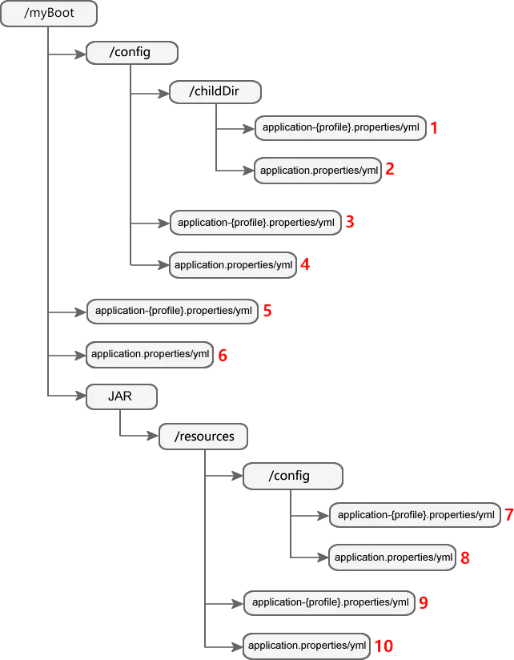

# Spring Boot配置加载顺序

Spring Boot 不仅可以通过配置文件进行配置，还可以通过环境变量、命令行参数等多种形式进行配置。这些配置都可以让开发人员在不修改任何代码的前提下，直接将一套 Spring Boot 应用程序在不同的环境中运行。

## 1、Spring Boot配置优先级

以下是常用的Spring Boot配置形式及其加载顺序（优先级由高到低）：  
- 命令行参数
- 来自 java:comp/env 的 JNDI 属性
- Java 系统属性（System.getProperties()）
- 操作系统环境变量
- RandomValuePropertySource 配置的 random.* 属性值
- 配置文件（YAML文件、Properties 文件）
- @Configuration 注解类上的 @PropertySource 指定的配置文件
- 通过SpringApplication.setDefaultProperties 指定的默认属性

以上所有形式的配置都会被加载，当存在相同配置内容时，高优先级的配置会覆盖低优先级的配置，存在不同的配置内容时，高优先级和低优先级的配置内容取并集，共同生效，形成互补配置。

## 2、命令行参数

Spring Boot中的所有配置，都可以通过命令行参数进行指定，其配置形式如下：
```java
java -jar {jar文件名} --{参数1}={参数值1} --{参数2}={参数值2}

// 示例1，在SpringBoot项目启动时，使用一下命令
java -jar .\target\TestSpringBoot-0.0.1-SNAPSHOT.jar --server.port=9000 --server.servlet.context-path=/lee

// 执行结果如下所示
 :: Spring Boot ::                (v2.7.3)

2022-10-10 20:54:29.448  INFO 11644 --- [           main] e.l.t.TestSpringBootApplication          : Starting TestSpringBootApplication v0.0.1-SNAPSHOT using Java 17.0.3.1 on Lee with PID 11644 (D:\codeSpace\java\TestSpringBoot\target\TestSpringBoot-0.0.1-SNAPSHOT.jar started by Lee in D:\codeSpace\java\TestSpringBoot)
2022-10-10 20:54:29.453  INFO 11644 --- [           main] e.l.t.TestSpringBootApplication          : The following 1 profile is active: "prod"
2022-10-10 20:54:30.934  INFO 11644 --- [           main] o.s.b.w.embedded.tomcat.TomcatWebServer  : Tomcat initialized with port(s): 9000 (http)
2022-10-10 20:54:30.939  INFO 11644 --- [           main] o.apache.catalina.core.StandardService   : Starting service [Tomcat]
2022-10-10 20:54:30.949  INFO 11644 --- [           main] org.apache.catalina.core.StandardEngine  : Starting Servlet engine: [Apache Tomcat/9.0.65]
2022-10-10 20:54:31.064  INFO 11644 --- [           main] o.a.c.c.C.[Tomcat].[localhost].[/lee]    : Initializing Spring embedded WebApplicationContext
2022-10-10 20:54:31.064  INFO 11644 --- [           main] w.s.c.ServletWebServerApplicationContext : Root WebApplicationContext: initialization completed in 1522 ms
在容器中添加一个组件：userService
2022-10-10 20:54:31.577  INFO 11644 --- [           main] o.s.b.w.embedded.tomcat.TomcatWebServer  : Tomcat started on port(s): 9000 (http) with context path '/lee'
2022-10-10 20:54:31.590  INFO 11644 --- [           main] e.l.t.TestSpringBootApplication          : Started TestSpringBootApplication in 2.924 seconds (JVM running for 3.531)
2022-10-10 20:55:53.821  INFO 11644 --- [nio-9000-exec-1] o.a.c.c.C.[Tomcat].[localhost].[/lee]    : Initializing Spring DispatcherServlet 'dispatcherServlet'
2022-10-10 20:55:53.821  INFO 11644 --- [nio-9000-exec-1] o.s.web.servlet.DispatcherServlet        : Initializing Servlet 'dispatcherServlet'
2022-10-10 20:55:53.830  INFO 11644 --- [nio-9000-exec-1] o.s.web.servlet.DispatcherServlet        : Completed initialization in 1 ms
```
## 3、配置文件

Spring Boot启动时，会自动加载JAR包内部及JAR包所在目录指定位置的配置文件（Properties文件和YAML文件），下面展示了Spring Boot自动加载配置文件的位置及其加载顺序，同一位置下Properties文件优先级高于YAML文件。


上图说明如下：
- /myBoot：表示 JAR 包所在目录，目录名称自定义；
- /childDir：表示 JAR 包所在目录下 config目录的子目录，目录名自定义；
- JAR：表示 Spring Boot 项目打包生成的 JAR；
- 其余带有“/”标识的目录的目录名称均不能修改。
- 红色数字：表示该配置文件的优先级，数字越小优先级越高。

这些配置文件的优先级顺序，遵循一下规则：
- 先加载 JAR 包外的配置文件，再加载 JAR 包内的配置文件；
- 先加载 config 目录内的配置文件，再加载 config 目录外的配置文件；
- 先加载 config 子目录下的配置文件，再加载 config 目录下的配置文件；
- 先加载 appliction-{profile}.properties/yml，再加载application.properties/yml；
- 先加载 .properties 文件，再加载 .yml 文件。

示例2：

（1）创建一个名为 TestSpringBoot 的 Spring Boot 项目，并在src/main/resoources下创建以下4个配置文件。
```java
// 1、application.yml：默认配置
// 指定默认服务端口号（port）为 “8080”，上下文路径（context-path）为“/mybootdemo”，并激活开发环境（dev）的 profile
server:
  port: 8080 #端口号
  servlet:
    context-path: /lee //上下文路径或项目访问路径
spring:
  profiles:
    active: dev //激活开发环境配置

// 2、application-dev.yml：开发环境配置
// 指定开发环境端口号为 “8081”，上下文路径为“/in-dev”，配置如下。
server:
  port: 8081 //开发环境端口号 8081
  servlet:
    context-path: /in-dev //开发环境上下文路径为 in-dev
spring:
  config:
    activate:
      on-profile: dev //开发环境

// 3、application-test.yml：测试环境配置
// 指定测试环境端口号为 “8082”，上下文路径为“/in-test”，配置如下。
server:
  port: 8082 //测试环境端口 8082
  servlet:
    context-path: /in-test //测试环境上下文路径 /in-test
spring:
  config:
    activate:
      on-profile: test

// 4、application-prod.yml：生产环境配置
// 指定生产环境端口号为 “8083”，上下文路径为“/in-prod”，配置如下。
server:
  port: 8083 //端口号
  servlet:
    context-path: /in-prod //上下文路径
spring:
  config:
    activate:
      on-profile: prod
```
（2）执行以下 mvn 命令，将 TestSpringBoot 打包成 JAR，并将该 JAR 包移动到本次磁盘的某个目录下（例如 TestSpringBoot 目录）。
```java
mvn clean package
```
（3）在 JAR 包所在目录下创建 application.yml ，并设置上下文路径为“/out-default”，并激活生产环境（prod）Profile。
```java
//JAR 包外默认配置
server:
  servlet:
    context-path: /out-default
#切换配置
spring:
  profiles:
    active: prod //激活开发环境配置
```
（4）打开命令行窗口，跳转到 mySpringBoot 目录下，执行以下命令启动 Spring Boot。
```java
java -jar .\target\TestSpringBoot-0.0.1-SNAPSHOT.jar

// 启动结果如下所示
PS D:\codeSpace\java\TestSpringBoot\target> java -jar .\TestSpringBoot-0.0.1-SNAPSHOT.jar

  .   ____          _            __ _ _
 /\\ / ___'_ __ _ _(_)_ __  __ _ \ \ \ \
( ( )\___ | '_ | '_| | '_ \/ _` | \ \ \ \
 \\/  ___)| |_)| | | | | || (_| |  ) ) ) )
  '  |____| .__|_| |_|_| |_\__, | / / / /
 =========|_|==============|___/=/_/_/_/
 :: Spring Boot ::                (v2.7.3)

2022-10-10 21:35:16.583  INFO 16492 --- [           main] e.l.t.TestSpringBootApplication          : Starting TestSpringBootApplication v0.0.1-SNAPSHOT using Java 17.0.3.1 on Lee with PID 16492 (D:\codeSpace\java\TestSpringBoot\target\TestSpringBoot-0.0.1-SNAPSHOT.jar started by Lee in D:\codeSpace\java\TestSpringBoot\target)
2022-10-10 21:35:16.586  INFO 16492 --- [           main] e.l.t.TestSpringBootApplication          : The following 1 profile is active: "prod"
2022-10-10 21:35:18.024  INFO 16492 --- [           main] o.s.b.w.embedded.tomcat.TomcatWebServer  : Tomcat initialized with port(s): 8083 (http)
2022-10-10 21:35:18.036  INFO 16492 --- [           main] o.apache.catalina.core.StandardService   : Starting service [Tomcat]
2022-10-10 21:35:18.037  INFO 16492 --- [           main] org.apache.catalina.core.StandardEngine  : Starting Servlet engine: [Apache Tomcat/9.0.65]
2022-10-10 21:35:18.153  INFO 16492 --- [           main] o.a.c.c.C.[.[localhost].[/out-default]   : Initializing Spring embedded WebApplicationContext
2022-10-10 21:35:18.153  INFO 16492 --- [           main] w.s.c.ServletWebServerApplicationContext : Root WebApplicationContext: initialization completed in 1477 ms
在容器中添加一个组件：userService
2022-10-10 21:35:18.651  INFO 16492 --- [           main] o.s.b.w.embedded.tomcat.TomcatWebServer  : Tomcat started on port(s): 8083 (http) with context path '/out-default'
2022-10-10 21:35:18.666  INFO 16492 --- [           main] e.l.t.TestSpringBootApplication          : Started TestSpringBootApplication in 2.804 seconds (JVM running for 3.311)
```
示例分析：
- Spring Boot 在启动时会加载全部的 5 个配置文件，其中位于 JAR 包外的 application.yml 优先级最高；
- 在 JAR 包外的 application.yml 中，配置激活了生产环境（prod）Profile，即 JAR 包内部的 application-prod.yml 生效。此时，该项目中的配置文件优先级顺序为：JAR 包外 application.yml > JAR 包内 application-prod.yml >JAR 包内其他配置文件;
- application-prod.yml 的配置内容会覆盖 JAR 包内所有其他配置文件的配置内容，即端口号（port）为“8083”，上下文路径（context-path）为“/in-prod”;
- JAR 包内的 application-prod.yml 中的上下文路径会被 JAR 包外的 application.yml 覆盖为“/out-default”;
- JAR 包内的 application-prod.yml 与 JAR 包外的 application.yml，形成互补配置，即，端口号为“8083”，上下文路径为“/out-default”。